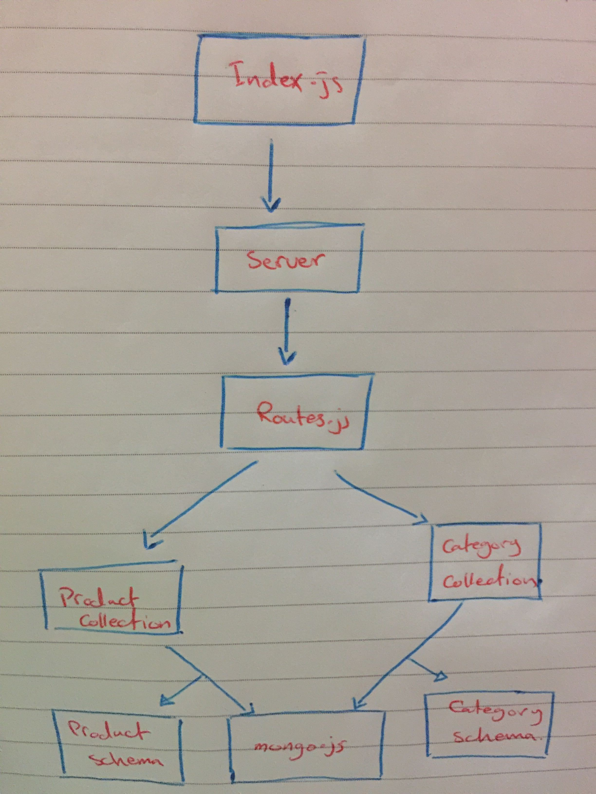

# api-server

**API to serve data**
we will create an `API` to generate data using:
* `GET` to read the data.
* `POST` to add new data.
* `PUT` to edit the data (all the object)
* `PATCH` to edit the data (all the proparity)
* `DELETE` to delte the data

### Author: Yasmin Adaileh :sunglasses:

### Links and Resources :paperclip:
### Documentation
- [Submission PR](https://github.com/yasmin-401-advanced-javascript/api-server/pull/4)
- [Swagger](https://app.swaggerhub.com/apis/yasminadaileh1/api-lab8/0.1)

## Library Used

In this app I used only the **json-server**

### Modules
- `Node.js` 
- `Postman`
- `Swagger` 
- `HTTPie` 
- `curl`

### Packages
- `express`
- `jest` 
- `supertest`

## Instruction How to Install the Library

1. `npm i -g json-server` run it in the command line(Ubuntu)
1. `npm i express` run it in the command line(Ubuntu)
1. `npm i -D jest` run it in the command line(Ubuntu)
1. `npm i -D @code-fellows/supergoose` run it in the command line(Ubuntu)
1. `npm i cors ` run it in the command line(Ubuntu)
1. `npm i mongoose` run it in the command line(Ubuntu)
1. `npm i morgan` run it in the command line(Ubuntu)
1. `npm i dotenv` run it in the command line(Ubuntu)

## How to run the app? :runner:

in the **Ubuntu** just type:
`nodemon` run it in the command line(Ubuntu)

## Resources :books:
  - http://localhost:3000/categories
  - http://localhost:3000/products

## UML

-------------------------------------------------------------------------
